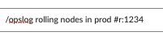
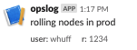
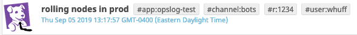

# opslog

A slack slash command that creates tagged datadog events.

Having a record of the manual tasks a devops team is performing is vital. It provides greater operational visibility, enhances communication, and gives unique insight during a PMR. Using or building off of this this terraform module can provide a team with another resource to precisely record potentially impacting real time events.

## example usage

To log a new event and tag it use the slash command like follows:



After privately replying to you with the datadog URL, opslog will ack your entry in the channel:



opslog will also create a Datadog event, using the slash commands hashtags as tags:



## installing

1. submodule or clone this into a terraform repo's modules folder, $wherever that may be.
2. ensure you have a file like the following with all the variables set.

    ```terraform
    module "opslog" {
        source = "./modules/terraform-aws-opslog"

        dd_api_key               = "${var.dd_api_key}"
        dd_app_key               = "${var.dd_app_key}"
        aws_account_id           = "${var.aws_account_id}"
        slack_verification_token = "${var.slack_verification_token}"
        slack_oauth_token        = "${var.slack_oauth_token}"
        aws_endpoint_region      = "us-east-1"
        datadog_team             = "my-cool-team"

    }
    resource "aws_api_gateway_deployment" "opslog_deployment" {
        depends_on  = ["module.opslog.opslog_url"]
        rest_api_id = "${module.opslog.opslog_url}"
        stage_name  = "prod"
    }

    output "opslog_url" {
        value       = "${aws_api_gateway_deployment.opslog_deployment.invoke_url}"
        description = "This is the base URL to give to slack for the endpoint /opslog"
    }
    ```

3. run `terraform init` again to load the new module.
4. apply the terraform
5. add the URL output from the terrorm + `/opslog` as the slash command URL
